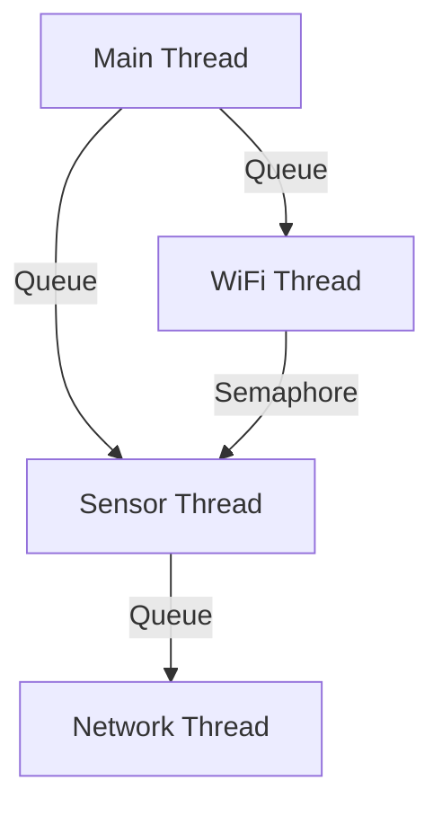
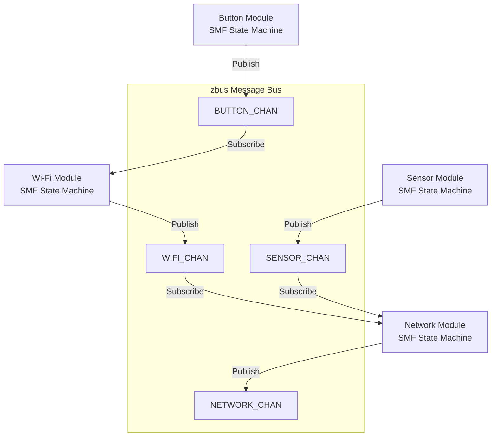
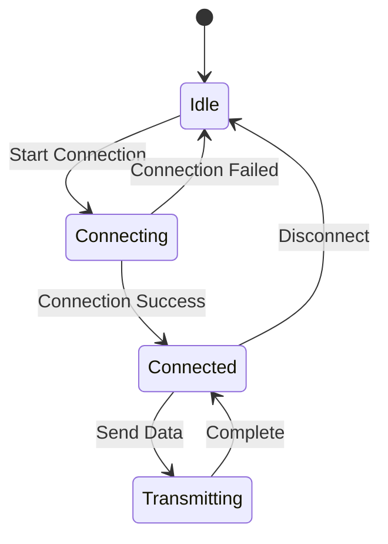
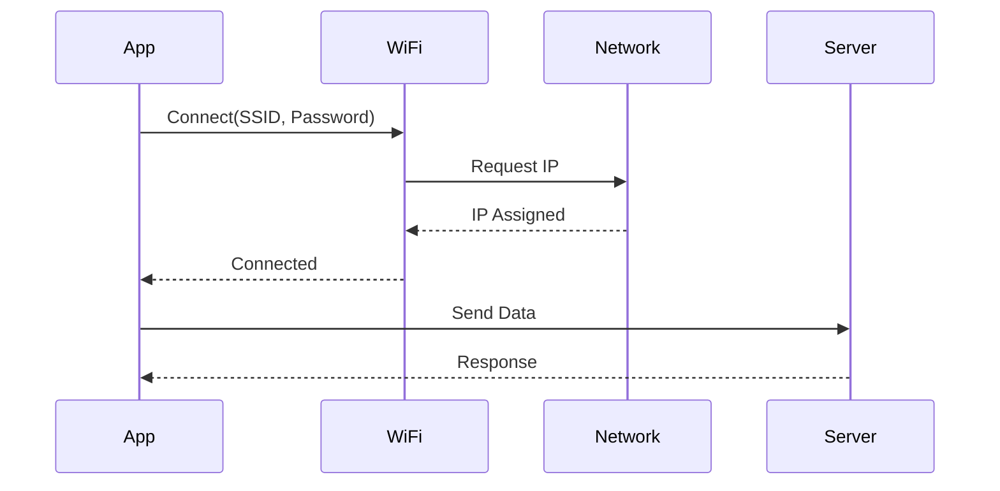

# Product Requirements Document (PRD)

## Document Information

- **Product Name**: [Product Name]
- **Product ID**: [Unique ID]
- **Document Version**: [Version]
- **Date Created**: [Creation Date]
- **Product Manager**: [Name]
- **Status**: [Draft / In Review / Approved / Released]
- **Target Release**: [Release Version / Date]

---

## 1. Executive Summary

### 1.1 Product Overview

**Brief description of the product, its purpose, and target market.**

[1-2 paragraph summary]

### 1.2 Problem Statement

**What problem does this product solve?**

[Description of the problem and pain points]

### 1.3 Target Users

**Who will use this product?**

- **Primary Users**: [Description]
- **Secondary Users**: [Description]
- **User Personas**: [Link to personas or brief description]

### 1.4 Success Metrics

| Metric | Target | Measurement Method |
|--------|--------|-------------------|
| [Metric 1] | [Target value] | [How to measure] |
| [Metric 2] | [Target value] | [How to measure] |

---

## 2. Product Requirements

### 2.1 Feature Selection & Technical Stack

Select the features required for this project. This drives architecture, configuration, and test planning.

> **Reference**: See `FEATURE_QUICK_REF.md` for memory requirements and dependencies.
> **Detailed Guide**: See `guides/FEATURE_SELECTION.md` for code examples and configuration details.

#### Core Wi-Fi Features (nRF70 Series)

| Feature | Selected | Config Option | Description | Flash | RAM |
|---------|----------|---------------|-------------|-------|-----|
| Wi-Fi Shell | ☐ | `CONFIG_WIFI=y`<br>`CONFIG_NET_L2_WIFI_SHELL=y` | Wi-Fi management via shell commands | ~5 KB | ~2 KB |
| Wi-Fi STA | ☐ | `CONFIG_WIFI=y`<br>`CONFIG_WIFI_NM_WPA_SUPPLICANT=y` | Station mode - connect to AP | ~60 KB | ~40 KB |
| Wi-Fi SoftAP | ☐ | `CONFIG_NRF70_AP_MODE=y`<br>`CONFIG_WIFI_NM_WPA_SUPPLICANT_AP=y` | Create access point for clients | ~65 KB | ~50 KB |
| Wi-Fi P2P | ☐ | `CONFIG_WIFI_NM_WPA_SUPPLICANT_P2P=y` | Wi-Fi Direct peer-to-peer | ~70 KB | ~45 KB |
| Wi-Fi Scan | ☐ | `CONFIG_NRF_WIFI_SCAN_MAX_BSS_CNT=20` | Network scanning | ~5 KB | ~10 KB |
| Wi-Fi Monitor Mode | ☐ | `CONFIG_NRF70_MONITOR_MODE=y` | Packet monitoring/sniffing | ~10 KB | ~15 KB |
| Wi-Fi Low Power | ☐ | `CONFIG_NRF_WIFI_LOW_POWER=y` | Power management | - | - |

#### Network Protocol Features

| Feature | Selected | Config Option | Description | Flash | RAM |
|---------|----------|---------------|-------------|-------|-----|
| IPv4 | ☐ | `CONFIG_NET_IPV4=y` | IPv4 networking | ~15 KB | ~5 KB |
| IPv6 | ☐ | `CONFIG_NET_IPV6=y` | IPv6 networking | ~25 KB | ~10 KB |
| UDP | ☐ | `CONFIG_NET_UDP=y` | User Datagram Protocol | ~5 KB | ~2 KB |
| TCP | ☐ | `CONFIG_NET_TCP=y` | Transmission Control Protocol | ~20 KB | ~10 KB |
| MQTT | ☐ | `CONFIG_MQTT_LIB=y` | MQTT client | ~15 KB | ~8 KB |
| HTTP Client | ☐ | `CONFIG_HTTP_CLIENT=y` | HTTP client for REST APIs | ~10 KB | ~5 KB |
| HTTP Server | ☐ | `CONFIG_HTTP_SERVER=y` | HTTP server | ~25 KB | ~20 KB |
| WebSocket | ☐ | `CONFIG_WEBSOCKET_CLIENT=y` | WebSocket client | ~8 KB | ~5 KB |
| CoAP | ☐ | `CONFIG_COAP=y` | Constrained Application Protocol | ~12 KB | ~6 KB |
| LwM2M | ☐ | `CONFIG_LWM2M=y` | Lightweight M2M protocol | ~40 KB | ~15 KB |
| DHCP Client | ☐ | `CONFIG_NET_DHCPV4=y` | DHCP client | ~8 KB | ~4 KB |
| DHCP Server | ☐ | `CONFIG_NET_DHCPV4_SERVER=y` | DHCP server for SoftAP | ~12 KB | ~8 KB |
| DNS Client | ☐ | `CONFIG_DNS_RESOLVER=y` | DNS resolution | ~6 KB | ~3 KB |
| mDNS | ☐ | `CONFIG_MDNS_RESPONDER=y` | Multicast DNS | ~10 KB | ~5 KB |
| SNTP | ☐ | `CONFIG_SNTP=y` | Simple Network Time Protocol | ~5 KB | ~2 KB |

#### Cellular Features (nRF91 Series)

| Feature | Selected | Config Option | Description | Flash | RAM |
|---------|----------|---------------|-------------|-------|-----|
| LTE Link Control | ☐ | `CONFIG_LTE_LINK_CONTROL=y` | LTE modem control | ~20 KB | ~10 KB |
| Modem Info | ☐ | `CONFIG_MODEM_INFO=y` | Modem information | ~5 KB | ~2 KB |
| SMS | ☐ | `CONFIG_SMS=y` | SMS messaging | ~8 KB | ~4 KB |
| GNSS | ☐ | `CONFIG_NRF_CLOUD_GNSS=y` | GPS/GNSS location | ~15 KB | ~8 KB |
| A-GNSS | ☐ | `CONFIG_NRF_CLOUD_AGPS=y` | Assisted GPS | ~10 KB | ~5 KB |
| P-GPS | ☐ | `CONFIG_NRF_CLOUD_PGPS=y` | Predicted GPS | ~12 KB | ~6 KB |

#### Bluetooth Features

| Feature | Selected | Config Option | Description | Flash | RAM |
|---------|----------|---------------|-------------|-------|-----|
| BLE | ☐ | `CONFIG_BT=y` | Bluetooth Low Energy | ~40 KB | ~20 KB |
| BLE Central | ☐ | `CONFIG_BT_CENTRAL=y` | BLE central role | ~5 KB | ~3 KB |
| BLE Peripheral | ☐ | `CONFIG_BT_PERIPHERAL=y` | BLE peripheral role | ~5 KB | ~3 KB |
| BLE GATT | ☐ | `CONFIG_BT_GATT_CLIENT=y` | GATT client | ~8 KB | ~4 KB |
| BLE Mesh | ☐ | `CONFIG_BT_MESH=y` | Bluetooth Mesh | ~60 KB | ~30 KB |
| NUS (UART Service) | ☐ | `CONFIG_BT_NUS=y` | Nordic UART Service | ~3 KB | ~2 KB |

#### Security & Crypto Features

| Feature | Selected | Config Option | Description | Flash | RAM |
|---------|----------|---------------|-------------|-------|-----|
| TLS/DTLS | ☐ | `CONFIG_MBEDTLS=y` | TLS/DTLS encryption | ~80 KB | ~40 KB |
| PSA Crypto | ☐ | `CONFIG_PSA_CRYPTO_DRIVER_ALG_ENABLE=y` | Platform Security Arch | ~30 KB | ~10 KB |
| Secure Boot | ☐ | `CONFIG_SECURE_BOOT=y` | Bootloader security | ~15 KB | - |
| HW Crypto | ☐ | `CONFIG_HW_CC3XX=y` | Hardware crypto (nRF91) | - | - |

#### Cloud & IoT Services

| Feature | Selected | Config Option | Description | Flash | RAM |
|---------|----------|--------------|-------------|-------|-----|
| nRF Cloud | ☐ | `CONFIG_NRF_CLOUD=y` | Nordic cloud integration | ~35 KB | ~15 KB |
| AWS IoT | ☐ | `CONFIG_AWS_IOT=y` | AWS IoT Core | ~40 KB | ~20 KB |
| Azure IoT Hub | ☐ | `CONFIG_AZURE_IOT_HUB=y` | Microsoft Azure IoT | ~45 KB | ~25 KB |
| Google Cloud IoT | ☐ | `CONFIG_CLOUD_API=y` | Google Cloud Platform | ~35 KB | ~18 KB |
| Memfault | ☐ | `CONFIG_MEMFAULT=y` | Device monitoring & debugging | ~30 KB | ~12 KB |

#### Storage & File System

| Feature | Selected | Config Option | Description | Flash | RAM |
|---------|----------|---------------|-------------|-------|-----|
| Flash | ☐ | `CONFIG_FLASH=y` | Flash memory access | ~5 KB | ~2 KB |
| NVS | ☐ | `CONFIG_NVS=y` | Non-volatile storage | ~8 KB | ~3 KB |
| Settings | ☐ | `CONFIG_SETTINGS=y` | Settings subsystem | ~10 KB | ~4 KB |
| FCB | ☐ | `CONFIG_FCB=y` | Flash Circular Buffer | ~6 KB | ~2 KB |
| LittleFS | ☐ | `CONFIG_FILE_SYSTEM_LITTLEFS=y` | LittleFS file system | ~25 KB | ~10 KB |
| FAT FS | ☐ | `CONFIG_FILE_SYSTEM_FAT=y` | FAT file system | ~40 KB | ~15 KB |

#### Development & Debugging

| Feature | Selected | Config Option | Description | Flash | RAM |
|---------|----------|---------------|-------------|-------|-----|
| Shell | ☐ | `CONFIG_SHELL=y` | Interactive shell | ~15 KB | ~8 KB |
| Logging | ☐ | `CONFIG_LOG=y` | Logging subsystem | ~10 KB | ~5 KB |
| Assert | ☐ | `CONFIG_ASSERT=y` | Runtime assertions | ~2 KB | - |
| Thread Analyzer | ☐ | `CONFIG_THREAD_ANALYZER=y` | Thread monitoring | ~5 KB | ~3 KB |
| CPU Stats | ☐ | `CONFIG_THREAD_RUNTIME_STATS=y` | CPU usage statistics | ~3 KB | ~2 KB |
| Stack Sentinel | ☐ | `CONFIG_STACK_SENTINEL=y` | Stack overflow detection | ~1 KB | - |

#### State Management & Architecture

| Feature | Selected | Config Option | Description | Flash | RAM |
|---------|----------|---------------|-------------|-------|-----|
| SMF | ☐ | `CONFIG_SMF=y` | State Machine Framework | ~4 KB | ~2 KB |
| Zbus | ☐ | `CONFIG_ZBUS=y` | Message bus | ~6 KB | ~3 KB |
| Event Manager | ☐ | `CONFIG_EVENT_MANAGER=y` | Event-driven architecture | ~8 KB | ~4 KB |

#### Peripheral & Sensors

| Feature | Selected | Config Option | Description | Flash | RAM |
|---------|----------|---------------|-------------|-------|-----|
| GPIO | ☐ | `CONFIG_GPIO=y` | GPIO control | ~3 KB | ~1 KB |
| I2C | ☐ | `CONFIG_I2C=y` | I2C bus | ~4 KB | ~2 KB |
| SPI | ☐ | `CONFIG_SPI=y` | SPI bus | ~5 KB | ~2 KB |
| UART | ☐ | `CONFIG_UART=y` | UART serial | ~4 KB | ~2 KB |
| ADC | ☐ | `CONFIG_ADC=y` | Analog-to-Digital | ~5 KB | ~2 KB |
| PWM | ☐ | `CONFIG_PWM=y` | Pulse Width Modulation | ~4 KB | ~2 KB |
| Sensor API | ☐ | `CONFIG_SENSOR=y` | Generic sensor framework | ~8 KB | ~4 KB |
| DK Library | ☐ | `CONFIG_DK_LIBRARY=y` | Dev kit buttons/LEDs | ~3 KB | ~1 KB |

#### Build Command

Based on selected features, your project configuration is specified in `prj.conf`.

**Standard Build**:
```bash
west build -p -b <board_name>
```

**With Additional Overlay**:
```bash
west build -p -b <board_name> -- -DEXTRA_CONF_FILE="overlay-feature.conf"
```

**Multiple Overlays**:
```bash
west build -p -b <board_name> -- \
  -DEXTRA_CONF_FILE="overlay-1.conf;overlay-2.conf;overlay-3.conf"
```

**Supported Boards**:

**Wi-Fi Development (nRF70 Series)**:
- `nrf7002dk/nrf5340/cpuapp` - nRF7002 DK (Wi-Fi 6, nRF5340 + nRF7002)
- `nrf54l15dk/nrf54l15/cpuapp` - nRF54L15 DK + nRF7002EB (Wi-Fi 6 via external board)
- `nrf54lm20dk/nrf54lm20/cpuapp` - nRF54LM20 DK + nRF7002EB (Wi-Fi 6 via external board)

**Cellular Development (nRF91 Series)**:
- `nrf9160dk/nrf9160/ns` - nRF9160 DK (LTE-M/NB-IoT)
- `nrf9161dk/nrf9161/ns` - nRF9161 DK (LTE-M/NB-IoT)
- `thingy91/nrf9160/ns` - Thingy:91 (LTE-M/NB-IoT)

### 2.2 Functional Requirements

**Must Have (P0)**

| ID | User Story | Acceptance Criteria | Related Feature |
|----|------------|---------------------|-----------------||
| FR-001 | As a developer/user, I want to see comprehensive startup information when the device boots so that I can verify the device identity, configuration, and version | - Product name and version displayed<br>- Build date and time shown<br>- Board name in human-readable format (e.g., "nRF7002DK" not "nrf7002dk")<br>- MAC address in formatted notation (e.g., "F4:CE:36:00:8B:E9")<br>- NCS/SDK version displayed<br>- Firmware version shown<br>- Memory usage statistics (optional but recommended) | Logging, System Info |
| FR-002 | As a user, I want to [action] so that [benefit] | - Criteria 1<br>- Criteria 2 | [Feature] |

**Should Have (P1)**

| ID | User Story | Acceptance Criteria | Related Feature |
|----|------------|---------------------|-----------------||
| FR-101 | As a user, I want to [action] so that [benefit] | - Criteria 1<br>- Criteria 2 | [Feature] |

**Nice to Have (P2)**

| ID | User Story | Acceptance Criteria | Related Feature |
|----|------------|---------------------|-----------------||
| FR-201 | As a user, I want to [action] so that [benefit] | - Criteria 1<br>- Criteria 2 | [Feature] |

### 2.3 Non-Functional Requirements

#### System Information Display

**Startup Banner Requirements**:

All production-ready NCS applications must display comprehensive system information at startup for debugging, support, and version tracking purposes.

**Minimum Required Information**:

```
[00:00:00.332,214] <inf> main: ==============================================
[00:00:00.332,214] <inf> main: [Product Name]
[00:00:00.332,244] <inf> main: ==============================================
[00:00:00.332,275] <inf> main: Build: Feb  4 2026 10:39:11
[00:00:00.332,275] <inf> main: Board: nRF7002DK
[00:00:00.332,305] <inf> main: MAC: F4:CE:36:00:8B:E9
[00:00:00.332,305] <inf> main: ==============================================
```

**Recommended Additional Information**:

```
[00:00:00.332,305] <inf> main: Version: 1.2.0
[00:00:00.332,336] <inf> main: NCS: v3.2.1
[00:00:00.332,336] <inf> main: Zephyr: 3.8.0
[00:00:00.332,366] <inf> main: Flash: 256KB (128KB used, 50%)
[00:00:00.332,366] <inf> main: RAM: 128KB (64KB used, 50%)
[00:00:00.332,397] <inf> main: Heap: 32KB available
[00:00:00.332,397] <inf> main: ==============================================
```

**Implementation Guidance**:

1. **Board Name Conversion**: Display human-readable board names
   ```c
   // Convert CONFIG_BOARD to proper capitalization
   if (strstr(CONFIG_BOARD, "nrf7002dk")) {
       board_name = "nRF7002DK";
   } else if (strstr(CONFIG_BOARD, "nrf54lm20dk")) {
       board_name = "nRF54LM20DK";
   }
   ```

2. **MAC Address Retrieval**: Use Zephyr network interface API
   ```c
   struct net_if *iface = net_if_get_default();
   struct net_linkaddr *mac_addr = net_if_get_link_addr(iface);
   if (mac_addr && mac_addr->len == 6) {
       LOG_INF("MAC: %02X:%02X:%02X:%02X:%02X:%02X",
           mac_addr->addr[0], mac_addr->addr[1], mac_addr->addr[2],
           mac_addr->addr[3], mac_addr->addr[4], mac_addr->addr[5]);
   }
   ```

3. **Build Information**: Use compiler macros
   ```c
   LOG_INF("Build: %s %s", __DATE__, __TIME__);
   ```

4. **Version Information**: Define in Kconfig or header
   ```c
   LOG_INF("Version: %s", CONFIG_APP_VERSION);
   LOG_INF("NCS: %s", CONFIG_MCUBOOT_IMGTOOL_SIGN_VERSION);
   ```

**Formatting Requirements**:
- Use separators (e.g., `=====`) for visual clarity
- MAC address must use uppercase hex with colon separators (XX:XX:XX:XX:XX:XX)
- Board names must be properly capitalized (nRF7002DK, not nrf7002dk)
- Date format: MMM DD YYYY HH:MM:SS
- All information must be readable from serial logs for remote debugging

**Benefits**:
- Quick identification of device and firmware version in logs
- Essential for customer support and bug reports
- Enables remote debugging without physical access
- Facilitates QA testing and version tracking

#### Performance
- **Metric 1**: Specification (e.g., latency < 10ms)
- **Metric 2**: Specification (e.g., throughput > 1Mbps)

#### Power Consumption
- **Active Mode**: Target consumption
- **Sleep Mode**: Target consumption
- **Average**: Target consumption

#### Memory
- **Flash**: Target size (e.g., < 256KB)
- **RAM**: Target size (e.g., < 128KB)
- **Heap**: Target size

#### Reliability
- **MTBF**: Mean Time Between Failures
- **Uptime**: Target uptime percentage
- **Error Rate**: Acceptable error rate

### 2.4 Hardware Requirements

**Target Hardware**:

| Component | Model/Specification | Quantity | Notes |
|-----------|---------------------|----------|-------|
| Development Kit | [e.g., nRF7002DK] | 1 | Primary target |
| MCU | [Model and variant] | 1 | Required features |
| Sensor | [Model] | X | Interface type |
| Power Supply | [Specification] | 1 | Voltage requirements |

**Memory Requirements** (based on selected features):
- **Flash**: [X] KB (Available: [Y] KB)
- **RAM**: [X] KB (Available: [Y] KB)
- **Heap**: [X] KB

### 2.5 User Experience Requirements

**User Interface**:
- [Description of UI requirements]
- [Interaction patterns]
- [Accessibility requirements]

**User Flows**:
1. [Primary user flow]
2. [Secondary user flow]

---

## 3. Technical Specification

> **Note**: High-level architecture only. Detailed technical specifications are maintained in `openspec/specs/` directory.
> **OpenSpec Integration**: For module-level implementation details, state machines, APIs, and sequence diagrams, see:
> - `openspec/specs/architecture.md` - System architecture and patterns
> - `openspec/specs/[module-name].md` - Individual module specifications
> - `openspec/changes/` - Technical proposals and change tracking

### 3.1 Architecture Design

#### 3.1.1 Architecture Pattern Selection

Select the architectural pattern for this project:

| Pattern | Selected | Description | Best For |
|---------|----------|-------------|----------|
| Simple Multi-Threaded | ☐ | Traditional threads with direct communication (queues, semaphores) | Simple applications, quick prototypes, 1-3 modules |
| SMF + zbus Modular | ☐ | State machines with message-based communication | Complex applications, scalable systems, 4+ modules |

> **Reference**: See `guides/ARCHITECTURE_PATTERNS.md` for detailed comparison and implementation guide.

#### Selected Pattern: [Fill in selected pattern name]

**Justification**: [Why this pattern was chosen for this project]

**Trade-offs**:
- Pros: [List advantages]
- Cons: [List disadvantages]

#### 3.1.2 System Architecture

#### Simple Multi-Threaded Pattern



**Description**: Traditional multi-threaded architecture with direct communication.

#### SMF + zbus Modular Pattern



**Description**: Modular architecture with State Machine Framework and message-based communication.

#### 3.1.3 Software Architecture

**Layers**:
- **Application Layer**: Business logic and state machines
- **Communication Layer**: zbus message channels (if SMF+zbus) or queues/semaphores (if multi-threaded)
- **Network Layer**: Communication protocols
- **Driver Layer**: Hardware abstraction
- **RTOS Layer**: Zephyr RTOS

#### 3.1.4 Module Descriptions

#### Module 1: [Name]
- **Purpose**: What it does
- **Inputs**: What it receives
- **Outputs**: What it produces
- **Dependencies**: Other modules it depends on
- **Files**: `module1.c`, `module1.h`

#### Module 2: [Name]
- **Purpose**: What it does
- **Inputs**: What it receives
- **Outputs**: What it produces
- **Dependencies**: Other modules it depends on
- **Files**: `module2.c`, `module2.h`

#### 3.1.5 State Machines



#### 3.1.6 Sequence Diagrams



---

## 4. Development Plan

### 4.1 Milestones

| Milestone | Target Date | Deliverables | Status |
|-----------|-------------|--------------|--------|
| M1: Prototype | [Date] | - Feature 1<br>- Feature 2 | Planned |
| M2: Alpha | [Date] | - Feature 3<br>- Feature 4 | Planned |
| M3: Beta | [Date] | - All features<br>- Testing | Planned |
| M4: Release | [Date] | - Production ready | Planned |

### 4.2 Dependencies & Risks

**Dependencies**:
- [Dependency 1]: [Description and impact]
- [Dependency 2]: [Description and impact]

**Risks**:

| Risk | Impact | Probability | Mitigation |
|------|--------|-------------|------------|
| [Risk 1] | High/Medium/Low | High/Medium/Low | [Mitigation strategy] |
| [Risk 2] | High/Medium/Low | High/Medium/Low | [Mitigation strategy] |

### 4.3 Resource Requirements

**Team**:
- Product Manager: [Name]
- Engineering Lead: [Name]
- Developers: [Count/Names]
- QA: [Count/Names]
- Designer: [Name]

**External Resources**:
- [Resource 1]
- [Resource 2]

---

## 5. API Documentation (Technical Reference)

### 5.1 Module 1 API

#### Function: `function_name()`

**Purpose**: Brief description

**Prototype**:
```c
int function_name(param_type param1, param_type param2);
```

**Parameters**:
- `param1`: Description
- `param2`: Description

**Return Values**:
- `0`: Success
- `-ERRNO`: Error description

**Example**:
```c
int result = function_name(value1, value2);
if (result < 0) {
    LOG_ERR("Function failed: %d", result);
}
```

**Notes**: Additional information, constraints, or warnings

---

## 6. Configuration Guide

### 6.1 Kconfig Options

| Option | Type | Default | Description |
|--------|------|---------|-------------|
| `CONFIG_FEATURE1` | bool | n | Enable feature 1 |
| `CONFIG_PARAM1` | int | 1000 | Parameter description |
| `CONFIG_PARAM2` | string | "default" | Parameter description |

### 6.2 Device Tree Configuration

```dts
/ {
    custom_node {
        compatible = "vendor,device";
        property1 = <value>;
        property2 = <value>;
    };
};
```

### 6.3 Build Configurations

**Default Build**:
```bash
west build -p -b board_name
```

**Feature-Specific Builds**:

| Configuration | Overlay File | Use Case |
|---------------|--------------|----------|
| Feature 1 | `overlay-feature1.conf` | Description |
| Feature 2 | `overlay-feature2.conf` | Description |

---

## 7. Quality Assurance

### 7.1 Test Plan

#### 7.1.1 Test Strategy

- **Unit Tests**: Module-level testing
- **Integration Tests**: Inter-module testing
- **System Tests**: End-to-end testing
- **Performance Tests**: Benchmarking

#### 7.1.2 Test Cases

#### TC-001: Wi-Fi Reconnection after Router Power Cycle (Real-life Scenario)

**Objective**: Verify device robustly handles router power loss and automatically reconnects when service returns, with full application protocol recovery.

**Prerequisites**:
- Device connected to Test Router (AP) and all services operational
- Serial logging enabled for monitoring (INFO level minimum)
- Router power strip accessible
- MQTT/HTTPS/OTA or other network services configured and running

**Test Steps**:
1. Confirm device is connected to AP and IP address is assigned
2. Verify all network services operational (check logs for MQTT publish, HTTPS requests, etc.)
3. Unplug power source of the Test Router (simulate power outage)
4. Observe device logs for disconnection event (`NET_EVENT_WIFI_DISCONNECT_RESULT`)
5. Wait 90 seconds with router powered off
   - Verify device logs periodic reconnection attempts every 30 seconds
   - Verify device does NOT panic, crash, or exhaust resources
   - Verify reconnection logic checks WiFi state before attempting connection
6. Plug Test Router power back in
7. Wait for router to fully boot (approx. 60-90 seconds including beacon startup)
8. Observe device automatically reconnecting once AP is available
9. Verify full service restoration:
   - WiFi association and WPA key negotiation
   - IP address assignment via DHCP
   - DNS resolver functional
   - MQTT client reconnects and resumes publishing
   - HTTPS client resumes requests
   - Metrics/OTA services operational

**Expected Results**:

**WiFi Layer**:
- ✅ Device detects disconnection within 10 seconds
- ✅ Device logs reconnection attempts every 30 seconds: "WiFi still disconnected, retrying in 30 seconds"
- ✅ Device checks current WiFi state before each reconnection attempt
- ✅ Device successfully reconnects within 60 seconds of router beacon availability
- ✅ Connection uses stored credentials (no user intervention required)

**Network Stack**:
- ✅ IP address assigned via DHCP within 10 seconds of WiFi association
- ✅ NET_EVENT_L4_CONNECTED fires when IP is assigned
- ✅ DNS resolver functional (tested via subsequent protocol operations)

**Application Protocols**:
- ✅ MQTT client waits 15-20 seconds after L4_CONNECTED before attempting connection
- ✅ MQTT client connects to broker within 30 seconds of WiFi reconnect
- ✅ MQTT resumes publishing without errors
- ✅ HTTPS client waits 3-5 seconds after L4_CONNECTED before making requests
- ✅ HTTPS requests succeed without DNS failures (error -11)
- ✅ No socket errors (-128, -113) during reconnection sequence

**System Health**:
- ✅ No device reboot required
- ✅ No manual intervention (button press, app control) required
- ✅ No memory leaks or resource exhaustion during reconnect cycles
- ✅ All metrics and status indicators update correctly post-reconnection

**Timing Requirements**:
- WiFi disconnect detection: < 10 seconds
- WiFi reconnect (after router available): < 60 seconds
- MQTT reconnection: < 30 seconds after WiFi reconnect
- HTTPS recovery: < 15 seconds after WiFi reconnect
- **Total recovery time**: < 2 minutes from router power-on to full service restoration

**Acceptance Criteria**:
- Zero manual interventions required for full recovery
- All network services operational and error-free post-reconnection
- Reconnection logic resilient to multiple power cycle events
- Clean logs with no unnecessary errors during normal reconnection flow

**Actual Results**:
- [To be filled during testing]

**Status**: [Pass / Fail / Not Tested]

**Notes**: 
- Test with multiple router brands (TP-Link, Asus, Netgear, UniFi) to verify behavior with different beacon startup timings
- Repeat test 3-5 times to verify consistency
- Monitor for memory growth over multiple reconnect cycles
- See [RECONNECTION_PATTERNS.md](../../../Developer/ncs/project/wifi/guides/RECONNECTION_PATTERNS.md) for implementation details

**Related Requirements**: 
- FR-XXX (Network Resilience)
- FR-XXX (Automatic Recovery)
- FR-XXX (Application Protocol State Management)

**Priority**: P0 (Critical) - Real-world reliability essential for production deployment

#### TC-002: Startup Information Display Verification

**Objective**: Verify that all required system information is displayed correctly at device startup.

**Prerequisites**:
- Device flashed with firmware
- Serial console connected and logging enabled
- Test executed on all supported board variants

**Test Steps**:
1. Power on or reset the device
2. Capture serial output from boot sequence
3. Verify presence of all required information fields
4. Verify format compliance for each field

**Expected Results**:

**Required Fields (Must Have)**:
- ✅ Product name displayed
- ✅ Build date and time in format: `MMM DD YYYY HH:MM:SS`
- ✅ Board name in proper case (e.g., "nRF7002DK", "nRF54LM20DK")
- ✅ MAC address in format: `XX:XX:XX:XX:XX:XX` (uppercase hex, colon-separated)

**Recommended Fields (Should Have)**:
- ✅ Firmware/application version
- ✅ NCS version
- ✅ Zephyr version
- ✅ Memory usage statistics (Flash, RAM, Heap)

**Format Validation**:
- Visual separators present (e.g., `=====`)
- Log timestamps present
- Log level indicators present (e.g., `<inf>`)
- Text alignment consistent
- No truncated or corrupted information

**Example Valid Output**:
```
[00:00:00.332,214] <inf> main: ==============================================
[00:00:00.332,214] <inf> main: Nordic WiFi SoftAP Webserver
[00:00:00.332,244] <inf> main: ==============================================
[00:00:00.332,275] <inf> main: Build: Feb  4 2026 10:39:11
[00:00:00.332,275] <inf> main: Board: nRF7002DK
[00:00:00.332,305] <inf> main: MAC: F4:CE:36:00:8B:E9
[00:00:00.332,305] <inf> main: Version: 1.0.0
[00:00:00.332,336] <inf> main: NCS: v3.2.1
[00:00:00.332,366] <inf> main: ==============================================
```

**Validation Criteria**:
| Field | Validation | Status |
|-------|------------|--------|
| Product Name | Matches expected name | [ ] |
| Build Date | Valid date format, matches build | [ ] |
| Board Name | Proper capitalization | [ ] |
| MAC Address | 6 octets, uppercase, colon-separated | [ ] |
| Version | Matches tagged version | [ ] |

**Actual Results**:
- [To be filled during testing]

**Status**: [Pass / Fail / Not Tested]

**Notes**: 
- Test on multiple boards to verify board name detection
- MAC address should be unique per device
- Version information should match git tags or build metadata

---

#### TC-003: Application Protocol State Management

**Objective**: Verify proper state machine handling for MQTT/HTTPS/WebSocket clients during network transitions.

**Prerequisites**:
- Device running with MQTT and/or HTTPS client enabled
- WiFi connected and network operational
- Logging level set to INFO or DEBUG
- Serial console connected

**Test Steps**:
1. Monitor logs during initial boot and connection
2. Record time from "Network connectivity established" to first successful MQTT/HTTPS operation
3. Verify no failed connection attempts with error codes -128, -113, -11 during normal startup
4. Trigger WiFi disconnect (router reboot or `wifi disconnect` shell command)
5. Verify application protocols detect disconnection and stop operations
6. Restore WiFi connection
7. Verify application protocols wait for network stabilization before reconnecting
8. Monitor for proper sequence: WiFi connect → L4 connect → stabilization delay → protocol connect

**Expected Results**:
- ✅ First MQTT/HTTPS operation occurs 15-25 seconds after "Network connectivity established" (stabilization period)
- ✅ No DNS lookup failures (error -11) during initial connection
- ✅ No socket close (-128) or host unreachable (-113) errors during normal startup
- ✅ No rapid retry loops (>1 attempt per 5 seconds during startup)
- ✅ States transition correctly: DISCONNECTED → CONNECTING → CONNECTED
- ✅ Protocol clients only attempt operations when in CONNECTED state
- ✅ On WiFi disconnect, protocols immediately stop and return to DISCONNECTED state
- ✅ On WiFi reconnect, protocols wait appropriate stabilization period before reconnecting
- ✅ Logs show "Network not ready" or "Not connected" warnings instead of silent failures

**Acceptance Criteria**:
- Zero DNS/connection failures during normal startup sequence
- All publish/request operations succeed when device reports "connected"
- State transitions are logged and observable
- No operations attempted while network_ready == false
- Progressive retry logic visible: 3 quick retries (5s) then longer backoff (60s)

**Actual Results**:
- [To be filled during testing]

**Status**: [Pass / Fail / Not Tested]

**Notes**: See [RECONNECTION_PATTERNS.md](../../../Developer/ncs/project/wifi/guides/RECONNECTION_PATTERNS.md) for implementation patterns.

---

#### TC-004: Network Stabilization Delays

**Objective**: Verify appropriate delays prevent transient startup failures in application protocols.

**Prerequisites**:
- Device configured with MQTT, HTTPS, or other IP-based protocols
- Clean flash with no prior network state
- Serial logging enabled at INFO level

**Test Steps**:
1. Flash device and boot with WiFi credentials provisioned
2. Monitor logs from boot through first successful MQTT/HTTPS operation
3. Check for any DNS failures (error -11, "getaddrinfo() failed")
4. Check for socket errors (-128, -113)
5. Record timestamp of each event:
   - WiFi connected (WPA key negotiation complete)
   - L4 connected (IP assigned via DHCP)
   - First MQTT/HTTPS connection attempt
   - First successful MQTT/HTTPS operation
6. Verify stabilization delays are applied:
   - HTTPS: 3-5 seconds after L4 connect
   - MQTT: 15-20 seconds after L4 connect

**Expected Results**:
- ✅ HTTPS client waits ≥3 seconds after L4_CONNECTED before first request
- ✅ MQTT client waits ≥15 seconds after L4_CONNECTED before first connect attempt
- ✅ Zero DNS failures during initial connection sequence
- ✅ Zero -128 (socket close) or -113 (host unreachable) errors during normal startup
- ✅ Progressive retry logic visible: 3 quick retries (5s intervals) then longer backoff (60s)
- ✅ State re-verified after each delay (network may have dropped during wait)

**Timing Validation**:
```
[00:00:07.626] WiFi: CTRL-EVENT-CONNECTED
[00:00:11.505] L4: Network connectivity established
[00:00:14.565] HTTPS: Looking up example.com         ← 3s delay ✓
[00:00:27.685] MQTT: Connecting to broker            ← 16s delay ✓
```

**Acceptance Criteria**:
- Clean startup with no transient network errors in logs
- Delays are configurable via Kconfig
- All DNS lookups succeed on first attempt during normal operation
- Application threads verify `network_ready` flag after stabilization delays

**Actual Results**:
- [To be filled during testing]

**Status**: [Pass / Fail / Not Tested]

**Notes**: Stabilization delays may need adjustment for different network conditions (cellular, mesh, satellite).

---

#### TC-005: Idempotent Network Notifications

**Objective**: Verify network state notifications are safe to call multiple times without side effects.

**Prerequisites**:
- Device with multiple network-dependent modules (MQTT, HTTPS, OTA, etc.)
- Logging enabled at DEBUG level
- Ability to trigger rapid connect/disconnect cycles

**Test Steps**:
1. Monitor logs during boot
2. Count "Network connected, notifying X client" messages for each client
3. Verify each client receives exactly one notification per connection event
4. Trigger rapid WiFi disconnect/reconnect (e.g., via shell commands)
5. Verify clients don't receive duplicate notifications
6. Check semaphore state doesn't overflow/underflow
7. Verify "Already marked as ready, skipping duplicate" debug messages when appropriate

**Expected Results**:
- ✅ Each client receives exactly one connect notification per network-up event
- ✅ Duplicate calls log at DEBUG level: "Already marked as ready, skipping duplicate"
- ✅ No semaphore errors or thread hangs
- ✅ All clients properly transition to disconnected state on network-down event
- ✅ Disconnect handlers clean up resources (close sockets, reset state machines)

**Acceptance Criteria**:
- notify_connected() is idempotent (safe to call multiple times)
- notify_disconnected() is idempotent
- State flags prevent duplicate semaphore signals
- All clients handle state transitions correctly

**Actual Results**:
- [To be filled during testing]

**Status**: [Pass / Fail / Not Tested]

**Notes**: Critical for systems where multiple network events fire during startup or reconnection.

---

#### TC-006: [Test Case Name]

**Objective**: What is being tested

#### 7.1.3 Test Results Summary

| Test ID | Description | Status | Date | Tester |
|---------|-------------|--------|------|--------|
| TC-001 | Test description | Pass/Fail | Date | Name |
| TC-002 | Test description | Pass/Fail | Date | Name |

#### 7.1.4 Coverage Metrics

- **Code Coverage**: XX%
- **Branch Coverage**: XX%
- **Function Coverage**: XX%

### 7.2 Acceptance Criteria

**Definition of Done**:
- [ ] All P0 features implemented
- [ ] All test cases pass
- [ ] Code review completed
- [ ] Documentation complete
- [ ] Performance metrics met
- [ ] Security review passed

---

## 8. User Documentation

### 8.1 Getting Started

#### Hardware Setup
1. Step-by-step hardware assembly
2. Connections and wiring
3. Power requirements

#### Software Setup
1. Development environment setup
2. Building the firmware
3. Flashing instructions

### 8.2 Operation Guide

#### Normal Operation
1. Power on sequence
2. Configuration steps
3. Operating procedures

#### Advanced Features
- Feature 1 usage
- Feature 2 usage

### 8.3 Troubleshooting

| Symptom | Possible Cause | Solution |
|---------|---------------|----------|
| Issue 1 | Cause description | Resolution steps |
| Issue 2 | Cause description | Resolution steps |

### 8.4 FAQ

**Q: Question 1?**
A: Answer description

**Q: Question 2?**
A: Answer description

---

## 9. Release & Maintenance

### 9.1 CI/CD Automation

> **Workspace Application Requirement**: Every release-ready NCS project must follow the [workspace application pattern](https://docs.nordicsemi.com/bundle/ncs-latest/page/nrf/app_dev/create_application.html#workspace_application) with automated CI/CD.

**Required CI/CD Components**:

1. **`west.yml` Manifest**
   - Pin `sdk-nrf` revision (e.g., `v3.2.1`)
   - Enable reproducible builds
   - Support `west init -l <app>` workflow

2. **GitHub Actions Workflow** (`.github/workflows/build.yml`)
   - Extract NCS version from `west.yml`
   - Use official container: `ghcr.io/nrfconnect/sdk-nrf-toolchain:${NCS_VERSION}`
   - Build all supported board configurations
   - Run quality gates before merge

3. **Quality Gates** (Mandatory for PR approval)
   - ✅ Documentation validation (README structure, required files)
   - ✅ Static analysis (Zephyr checkpatch)
   - ✅ Code formatting (clang-format with Zephyr rules)
   - ✅ Build success for all target boards

4. **Automated Release** (on version tags)
   - Generate changelog from git history
   - Build firmware for all boards
   - Create release packages (`.hex` per board, combined `.zip`)
   - Publish GitHub Release with auto-generated notes

**Typical Workflow Structure**:
```yaml
jobs:
  set-version:       # Extract NCS version from west.yml
  build-and-test:    # Matrix build for all boards
  validate-documentation:  # Check README & config files
  static-analysis:   # Run checkpatch & clang-format
  create-release:    # Auto-release on tags (depends on all above)
```

**Release Process**:
```bash
# 1. Update version documentation
# 2. Create and push version tag
git tag -a v1.0.0 -m "Release v1.0.0"
git push origin v1.0.0
# 3. CI automatically builds, tests, and releases
```

**Quality Metrics**:
- All PRs blocked until CI passes
- Zero tolerance for formatting violations
- Documentation completeness enforced
- Release artifacts reproducible from tags

**Reference Implementation**: See [`nordic_wifi_opus_audio_demo/.github/workflows/build.yml`](https://github.com/chshzh/nordic_wifi_opus_audio_demo/blob/main/.github/workflows/build.yml) or [`nordic_wifi_softap_webserver/.github/workflows/build.yml`](https://github.com/chshzh/nordic_wifi_softap_webserver/blob/main/.github/workflows/build.yml)

### 9.2 Version History

| Version | Date | Author | Changes |
|---------|------|--------|---------|
| 1.0.0 | Date | Name | Initial release |
| 1.1.0 | Date | Name | Feature additions |

### 9.3 Known Limitations

| Issue ID | Description | Severity | Workaround | Status |
|----------|-------------|----------|------------|--------|
| ISS-001 | Issue description | High/Medium/Low | Workaround | Open/Fixed |

### 9.4 Product Roadmap

- **Version X.X**: Planned features
- **Future**: Long-term plans

### 9.5 Support & Maintenance Plan

- **Support Channels**: [List channels]
- **Update Frequency**: [Schedule]
- **End of Life**: [Policy]

---

## 10. References

### 10.1 Internal Documents
- [Document Name](link)
- [Document Name](link)

### 10.2 External Resources
- [Nordic nRF Connect SDK Documentation](https://developer.nordicsemi.com/)
- [Zephyr Project Documentation](https://docs.zephyrproject.org/)
- [Relevant Standards or Specifications]

### 10.3 Related Projects
- [Project Name](link)
- [Project Name](link)

---

## 11. Appendices

### Appendix A: Glossary

| Term | Definition |
|------|------------|
| Term 1 | Definition |
| Term 2 | Definition |

### Appendix B: Abbreviations

| Abbreviation | Full Form |
|--------------|-----------|
| NCS | nRF Connect SDK |
| PRD | Product Requirements Document |

### Appendix C: Schematics

[Include circuit diagrams, pinout diagrams, etc.]

### Appendix D: Code Examples

[Include relevant code snippets or examples]

---

---

## Document Approval

| Role | Name | Signature | Date |
|------|------|-----------|------|
| Product Manager | [Name] | | |
| Engineering Lead | [Name] | | |
| QA Lead | [Name] | | |
| Stakeholder | [Name] | | |

---

**Document Control**:
- **Last Updated**: [Date]
- **Review Cycle**: [Monthly / Quarterly]
- **Next Review**: [Date]
- **Change Log**: See Section 9.1
