# <Module Name> Module Specification

## Document Information

| Field | Value |
|-------|-------|
| Module | |
| Version | YYYY-MM-DD-HH-MM |
| PRD Version | YYYY-MM-DD-HH-MM |
| Author | |
| Status | Draft |

---

## Changelog

| Version | Summary of changes |
|---|---|
| YYYY-MM-DD-HH-MM | Initial module spec |

---

## Overview

<One paragraph describing the role of this module, what it does, and what it does NOT do.>
<Note any changes from a previous version if applicable.>

---

## Location

- **Path**: `src/modules/<name>/`
- **Files**: `<name>.c`, `<name>.h`, `Kconfig.<name>`, `CMakeLists.txt`

---

## Module Type

- [ ] **Application module** — follows the project architecture pattern (SMF+Zbus or multi-threaded).
- [ ] **Library wrapper module** — wraps an external library. The library runs its own internal
  threads; this module calls library APIs and implements library callbacks. Fill in the
  **External Library Interface** section below and omit or simplify the State Machine section.

---

## External Library Interface

> Fill in this section for library wrapper modules only. Remove for application modules.

| Field | Value |
|-------|-------|
| Library | e.g. Memfault SDK |
| NCS Kconfig | e.g. `CONFIG_MEMFAULT=y` |
| Library internal threads | e.g. `memfault_http_upload` (managed by SDK) |

**APIs called by this module** (app → library):

```c
/* Key library functions this module calls */
<lib_function_a>(/* params */);   /* purpose */
<lib_function_b>(/* params */);   /* purpose */
```

**Callbacks implemented by this module** (library → app):

```c
/* Callback signatures the library requires the app to implement */
void <lib_callback_a>(void) { /* app provides this */ }
```

**Zbus integration** — how library events are forwarded to the rest of the app:

| Library event / callback | Zbus channel published | Message |
|--------------------------|----------------------|---------|
| `<lib_callback>` fired | `<CHANNEL>` | `<message type>` |

> If the library has no Zbus integration (fire-and-forget), note it here.

---

## Zbus Integration

**Subscribes to**: `<CHANNEL_NAME>` — <when and why it reads this channel>

**Publishes to**: `<CHANNEL_NAME>`

```c
struct <msg_type> {
    enum <event_type> type;   /* <EVENT_A>, <EVENT_B>, ... */
    /* add fields */
};
```

> If this module has no Zbus dependency, replace this section with:
> "This module does not use Zbus. It is driven by <interrupt / timer / direct call>."

---

## State Machine

> Remove this section if the module does not use SMF.

```mermaid
stateDiagram-v2
    [*] --> Idle
    Idle --> <State_A>: <trigger>
    <State_A> --> <State_B>: <event>
    <State_B> --> Idle: <event>
    <State_A> --> Error: <error_event>
    Error --> Idle: reset
```



**State descriptions:**

| State | Description | Entry action | Exit action |
|-------|-------------|--------------|-------------|
| Idle | Waiting for trigger | — | — |
| `<State_A>` | <description> | <action> | <action> |
| Error | Unrecoverable error | log error | — |

---

## Kconfig Flags

| Symbol | Type | Default | Description |
|--------|------|---------|-------------|
| `CONFIG_<MODULE>_ENABLE` | bool | `y` | Enable this module |
| `CONFIG_<MODULE>_<PARAM>` | int | `<value>` | <description> |

---

## API / Public Interface

```c
/**
 * @brief <Brief description>
 * @param <param> <description>
 * @return 0 on success, negative errno on failure
 */
int <module>_<function>(/* params */);
```

> List all functions declared in `<name>.h` that other modules may call.
> Internal helpers should not appear here.

---

## Error Handling

| Error Condition | Detection | Response |
|----------------|-----------|----------|
| <error_a> | <how detected> | <log + action> |
| <error_b> | <how detected> | <log + action> |

---

## Memory Estimate

| Resource | Value | Notes |
|----------|-------|-------|
| Flash | ~X KB | code + read-only data |
| RAM (static) | ~X KB | `.bss` + `.data` |
| Stack | X bytes | thread stack if applicable |

---

## Test Points

| Scenario | UART log expected | Pass condition |
|----------|-------------------|----------------|
| Successful init | `[<name>] initialized` | Always on boot |
| <feature event> | `[<name>] <log message>` | When <condition> |
| Error path | `[<name>] error: <message>` | When <error condition> |

---

## Open Issues / TBD

- [ ] <Any unresolved design decision>
- [ ] <Dependency on another module not yet specified>

---

*(Changelog is maintained at the top of this document.)*
